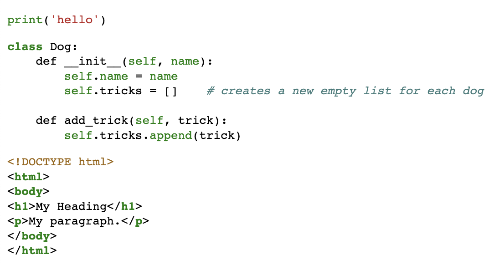

# django-pygmento
> Syntax highlighter for django templates based on Pygments.


## Usage example
- Install the package using
```bash
pip install django-pygmento
```

- Add `pygmento` to `INSTALLED_APPS` in your settings file.
- Load `pygmento` template tag
```html

```
- Include pygment css in `head` using the `pygmento_css` template tag or manually generate it as described [here](https://pygments.org/docs/quickstart/#command-line-usage) and add it to static files. 
```html
<head>
    
</head>
```

- Use `pygmento` as shown below
```
# Single line code
{{ "print('hello')"|pygmento:"python" }}

# Multi-line code block in python

class Dog:
    def __init__(self, name):
        self.name = name
        self.tricks = []    # creates a new empty list for each dog

    def add_trick(self, trick):
        self.tricks.append(trick)


# Multi-line code block in html

<!DOCTYPE html>
<html>
<body>
<h1>My Heading</h1>
<p>My paragraph.</p>
</body>
</html>

```

The above code will get rendered as




# Available styles
Styles can be set using `PYGMENTO_STYLE` setting.
```python
PYGMENTO_STYLE = "default"
```

See the list of available styles and how they look [here](https://pygments.org/styles/). 


## Meta

Apoorva Pandey – apoorvapandey365@gmail.com

Distributed under the BSD license.

[https://github.com/apoorvaeternity](https://github.com/apoorvaeternity)

## Contributing

1. Fork it (<https://github.com/apoorvaeternity/django-pygmento/>)
2. Create your feature branch (`git checkout -b feature/fooBar`)
3. Commit your changes (`git commit -m 'Add some fooBar'`)
4. Push to the branch (`git push origin feature/fooBar`)
5. Create a new Pull Request
